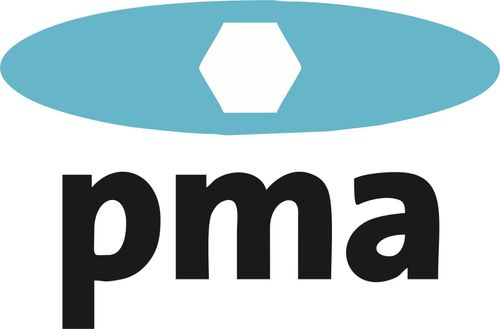

# PMA Data Exchange Standard

This repository defines the standard JSON data exchange formats between paragliding inspection bodies and manufacturers, as specified by the Paragliding Manufacturer Association (PMA). These formats ensure uniformity and reliability in assessing the airworthiness of used paragliders.

## Overview

The JSON format supports bidirectional data exchange:
- **Manufacturer → Inspection Body:** Manufacturer information needed for the inspection.
    * [specifications](specifications/specification_manufacturer-inspectionbody.md)
    * [simplify exemple](examples/exemple_manufacturer-InspectionBody.json)
    * [validator and json schema](validators/manufacturer_to_inspectionbody_python_validator.py)
    * [scripts](scripts/TODO.txt)
- **Inspection Body → Manufacturer:** Detailed reports of inspection results. 
    * [specifications](specifications/specification_inspectionbody-manufacturer.md)
    * [simplify exemple](examples/exemple_InspectionBody_manufacturer.json)
    * [validator and json schema](validators/inspectionbody_to_manufacturer_python_validator)
    * [scripts](scripts/TODO.txt)

## Contributions

We welcome any proposals or improvements to the PMA Data Exchange Standard. Your feedback and suggestions help us refine the standard to better meet the needs of the paragliding community. Feel free to submit issues or pull requests.

